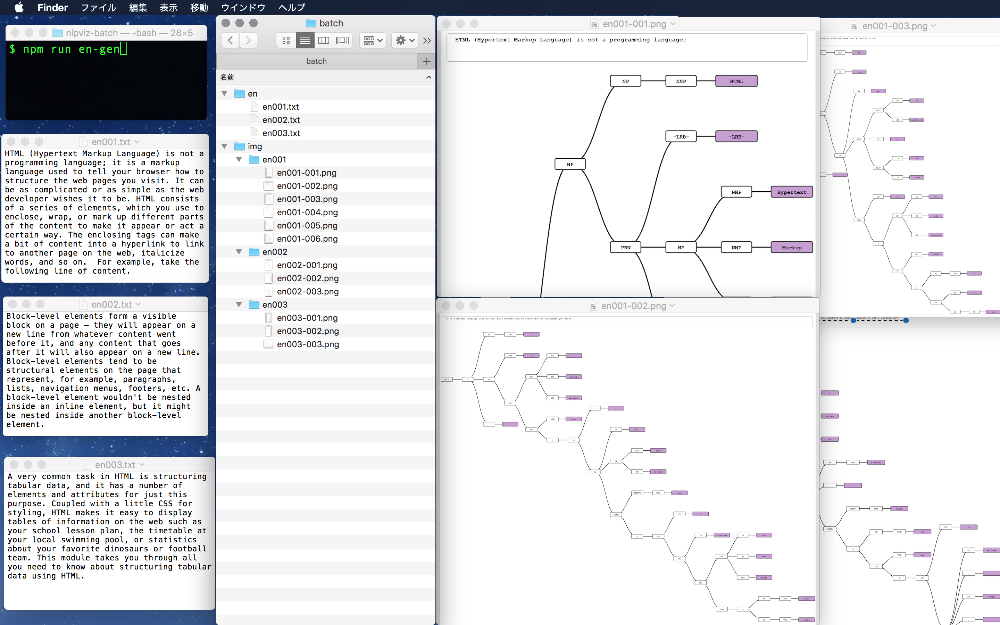

# nlpviz-batch

Nlpviz visualizes the structure of English sentences using Stanford CoreNLP and D3.js.

　　

This repository is a fork of [bpodgursky/nlpviz](https://github.com/bpodgursky/nlpviz).

I made this repository for my students.

## Requirement

[Java SE Development Kit 1.8.0_171](http://www.oracle.com/technetwork/java/javase/downloads/jdk8-downloads-2133151.html)

[Apache Maven 3.5.4](https://maven.apache.org)

[Node.js 8.9.3](https://nodejs.org/en/)

## Platform

Windows 10

## Installtion

```shell
$ npm install
```

The first time you run this, it will take some time and network bandwidth to install the dependencies - the Stanford NLP core model jar is on its own over 200 MB.

## Usage

1. put the English texts in batch/en directory as text file as follows:
```
/batch/en/
   --english001.txt
   --english002.txt
   --english003.txt
```

2. start batch command
If you type the command as bellow, a series of images will be generated.

```
$ npm run en-gen
```

3. open the folder

In the `/batch/en/` directory, you can see the images.